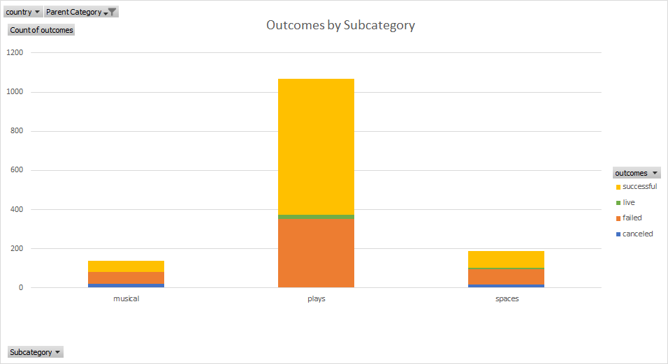

# Kickstarter Analysis

## Overview of Project
Perform analysis with <b>Excel</b> on Kickstarter fundraising campaigns data to uncover trends and help our client to adjust its future campaign projects in the U.S. and Great Britain for the best results.

## Analysis and Challenges
Since the client is planning a campaign for a "play" in the U.S. we have taken a look at the Kikckstarter campaigns done in the U.S. Out of the 4114 campaigns done, 1393 were for the category "theater" which make it the highest in term of campaign numbers.
 

 

Out of all the Kickstarter campaigns in the U.S., 1066 were for plays and over 76% of those campaigns were successful. This makes the plays as the most successful category for Kickstarter campaigns in the U.S. 
 

### Analysis of Outcomes Based on Launch Date
To help the campaign timeline, we need to take a closer look at how campaign length might be tied to its outcome. We should consider time, or more specifically, whether the length of a campaign makes a difference in determining its success. For example, is a shorter or longer campaign more effective? Is there a certain time of year when campaigns tend to be more successful?
 

 

Line charts are helpful when trying to determine trends. The chart shows the months that launched the most successful campaigns was May, June and July. However, May to October, all had roughly the same number of failed campaigns launched. Overal May, June and July is the best time to run the campaigns.
 

### Analysis of Outcomes Based on Goals
To continue to help the campaign, we need to be more specific with our searches. In this way we will be able to pinpoint the ones most similar client's vision. Now, we need to collect the outcome and goal data for the “plays” and visualize the percentage of successful, failed, and canceled plays based on the funding goal amount.
 

 

The graph is based on the goals and the percentage(suucessful, failed, and cancelled campaigns). Goals are in the range of 5000.
Each percentage is coming from the subcategory data filterd by "plays", meaning that only those specific subcategories are considered in this outcome, because it had the most successfull occurances. There is approximately 50% chance for theatre plays to be successful if the Campaign goal is less than $20,000. However, the success percentage increases as one lowers the Campaign goal. For example, if the Campaign goal is $5000, the percentage increases to about 60%. It can further increase to about 75% if the Campaign goal is in the range of $1000.  

## Results
- Conclusions about the Outcomes based on Launch Date:
    1. Between May and June are the best time to run a campaign.
    2. July has the least canceled theater project, and so is the best time to run the campaign.

- Conclusion about the Outcomes based on Goals:
    1. The most successful capaigns are the ones that have goal less than 5000 or goal between 35000 and 50000.
    
- Limitations of this dataset:
    1. One limitation could be lack of recent data. There is no current data, the most recent campaign was in 2017. Recent data can help better uncover certain trends in types of successful Kickstarter data currently.
    2. More data in the parent category theatre and subcategory plays would help a stronger outcome prediction.

- Some other possible tables and/or graphs that we could create:
    1. We might need a graph to show the relation between the sucessfull projects and the number of backers. 

## Recommendation
The client should strongly start its Theatre Play Campaign in the months of May, June and July, and seek to lower the campaign goal of $10,000.  

------------------------------------------------
